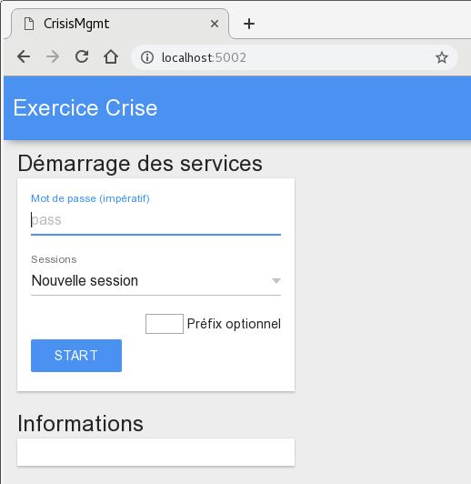
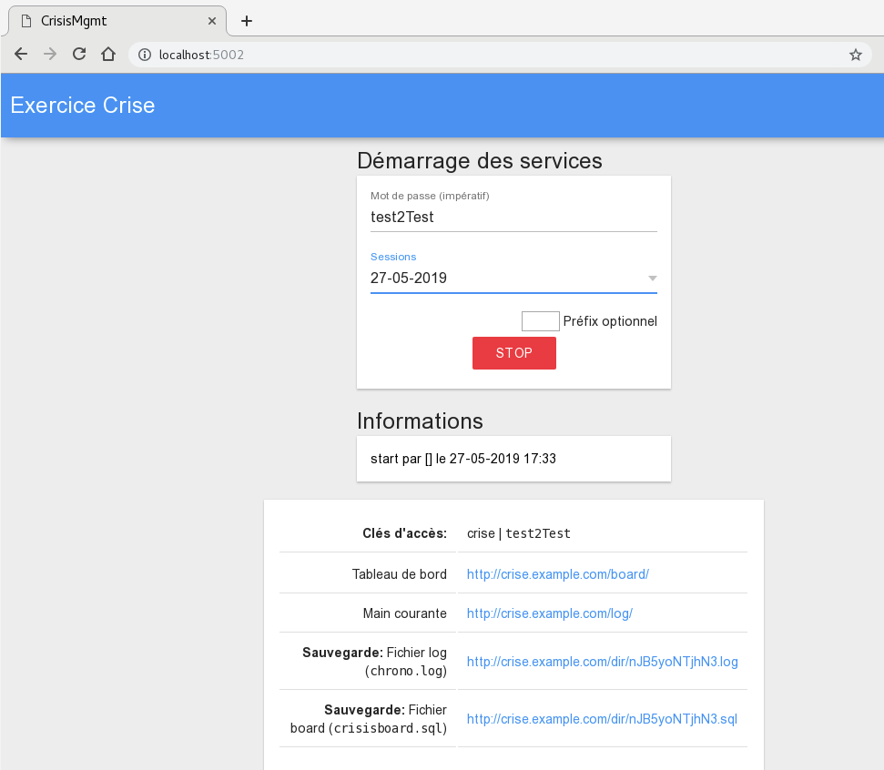

# CrisisMgmt

[](https://goreportcard.com/report/github.com/yvesago/CrisisMgmt)
[](https://travis-ci.org/yvesago/CrisisMgmt)
[](https://coveralls.io/github/yvesago/CrisisMgmt)

Statut: travail en cours

Serveur de gestion d'exercices de crise.

L'usage d'un serveur pour gérer une situation de crise est un point faible critique. Ce serveur ne doit être utilisé que pour organiser des exercices.

# Description


Le daemon ``CrisisMgmt`` est un serveur web. Il permet d'administrer la définition d'un mot de passe, le démarrage et l'arrêt des processus [CrisisBoard](https://github.com/yvesago/CrisisBoard) (le **Tableau de Bord**) et [CrisisLog](https://github.com/yvesago/CrisisLog) (la **Main Courante**).


# Démarrage Rapide


```
$ git clone https://github.com/yvesago/CrisisMgmt
$ cd CrisisMgmt
$ go build

$ ./CrisisMgmt -conf confsample.json -d
```

``CrisisMgmt`` est accessible sur le port 5002.

Les binaires ``CrisisLog`` et ``CrisisBoard`` doivent se trouver dans le dossier courant. Un sous dossier `files/` contient les bases de travail.

```
$ ln -s ../files/CrisisLog_003_linux_amd64 CrisisLog
$ ln -s ../files/CrisisBoard_003_linux_amd64 CrisisBoard
$ mkdir files/
```


L'interface de gestion permet de définir un mot de passe partagé et démarrer les applications.




Lorsque les processus sont démarrés, ``CrisisLog`` est accessible sur le port 5001, ``CrisisBoard`` est accessible sur le port 5000.




Le fichier de configuration ``conf.json`` permet de définir dossiers et url spécifiques pour un déploiement sur un serveur.


# Déploiement serveur

Le déploiement sur un serveur permet de gérer l'accès partagé et distribuer les binaires.

Structures des dossiers et fichiers:
```
conf/
 |_ conf.json

www/
 |_ files/
 |    |_ CrisisLog_003_linux_amd64
 |    |_ CrisisBoard_003_linux_amd64
 |    |_ ....
 |_ mgmt/
 |    |_ views/
 |    |      |_ index.html       # template
 |    |_ files/
 |    |      |_ XXXXXXXXX.log    # db main courante
 |    |      |_ XXXXXXXXX.sql    # db tableau de bord
 |    |      |_ ....
 |    |_ CrisisMgmt
 |    |_ CrisisLog -> ../files/CrisisLog_003_linux_amd64
 |    |_ CrisisBoard -> ../files/CrisisBoard_003_linux_amd64
 |_ index.html                   # page d'accueil
 |_ mui-combined.min.js
 |_ style.css

```

Le dossier ``doc/`` du dépôt contient des exemples pour la page d'accueil, le css ou un script de démarrage systemd.


## Configuration apache

La configuration apache ci-dessous permet d'accéder à l'interface d'administration et d'utiliser le gestionnaire de fichier intégré à Apache pour distribuer les binaires.

Structure des URLs:
```
apache:80
 |_ /index.html     # page d'accueil
    |_ files/       # gestionnaire de fichier apache
    |_ mgmt/  *    -> CrisisMgmt:5002 (démarrage/arrêt CrisisLog, CrisisBoard)
    |    |_ files/    #  fichiers dbs
    |_ log/        -> CrisisLog:5001
    |_ board/      -> CrisisBoard:5000


* authentification requise

```

### Configuration

Le mode proxy d'apache redirige les URLs vers les processus actifs en connectant également les websockets (/ws).


```
<VirtualHost *:80>
  ServerName exercice-crise.univ.fr
  ServerAdmin admin@univ.fr

  DocumentRoot /var/www/crise
  DirectoryIndex index.html

  # Distribution des binaires
  IndexStyleSheet "http://exercice-crise.univ.fr/style.css"
  IndexIgnore *.log *.sql
  AddDescription "Windows" .exe
  AddDescription "Mac" darwin
  AddDescription "Linux" linux

  # Configuration
  <Directory "/var/www/crise">
    AllowOverride None
    Options  +Indexes
    Require all granted
  </Directory>

  # Accès restreint à l'interface d'administration
  # avec exemple d'authentification basic
  <Location /mgmt>
    AuthType Basic
    AuthName "Basic Auth"
    AuthUserFile "/var/www/.htpass"
    Require valid-user
    RequestHeader set X-Forwarded-User %{REMOTE_USER}s
  </Location>


  # Proxy vers les applications
  <Proxy *>
    Order deny,allow
    Allow from all
  </Proxy>

  ProxyPass /files/ !
  ProxyRequests Off
  ProxyPreserveHost On

  ProxyPass /mgmt/ws  ws://localhost:5002/ws
  ProxyPass /mgmt/ http://localhost:5002/
  ProxyPassReverse /mgmt/ http://localhost:5002/


  ProxyPass /log/ws  ws://localhost:5001/log/ws retry=30 ttl=120
  ProxyPass /log/  http://localhost:5001/share retry=30  ttl=120 disablereuse=on

  ProxyPass /board/med  http://localhost:5000/board/med retry=30 ttl=120
  ProxyPass /board/ws  ws://localhost:5000/board/ws retry=30 ttl=120
  ProxyPass /board/ http://localhost:5000/share retry=30 ttl=120 disablereuse=on
  ProxyPassReverse /board/ http://localhost:5000/share

  CustomLog /var/log/apache2/excrise_access.log combined
  ErrorLog /var/log/apache2/excrise_error.log

</Virtualhost>

```


## Licence

GPLv3 License

Copyright (c) 2019 Yves Agostini

